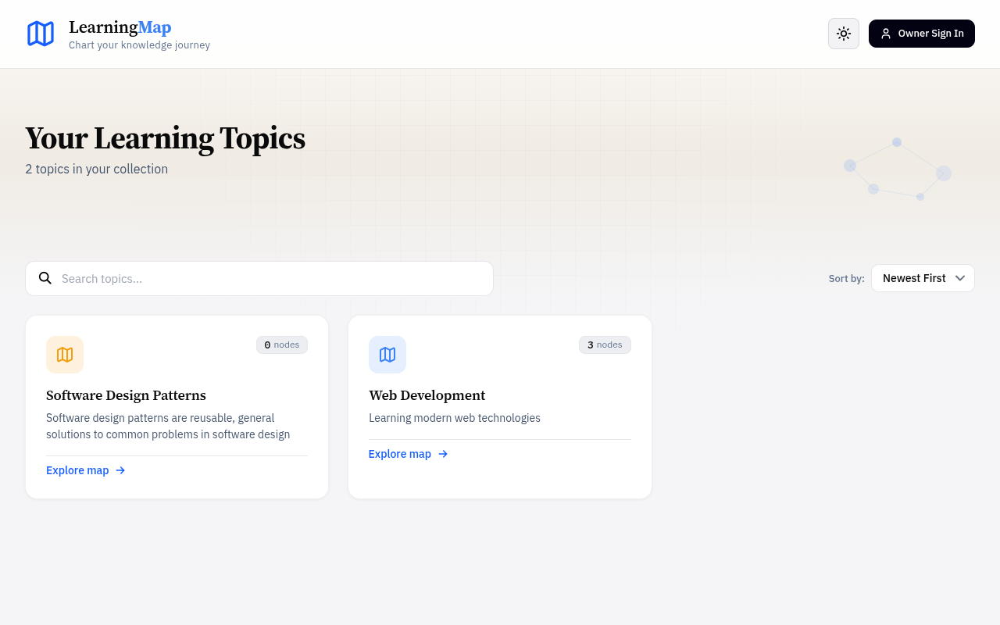
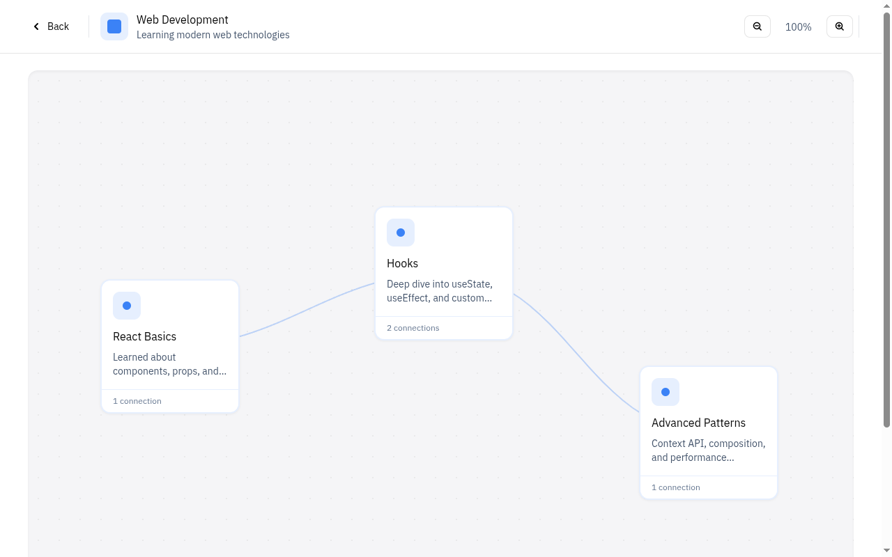
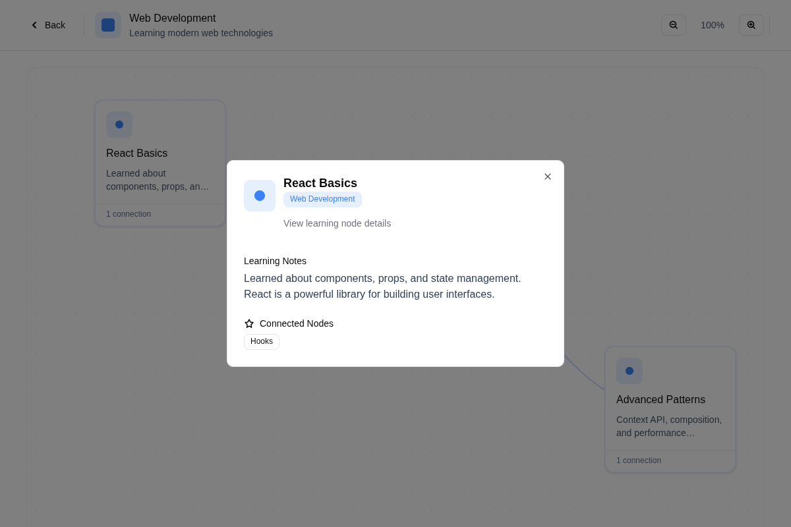

# Mind Map - Learning Tracker

A modern mind-map application for tracking your learning journey. Built with React 19 and Vite, featuring an intuitive interface for creating topics, adding learning nodes, and visualizing connections between concepts.

🔗 **[Live Demo](https://mind-map-flax.vercel.app/)**

## Features

- **Topic Management** - Create and organize learning topics with custom colors
- **Interactive Mind Maps** - Visual node-based learning maps with drag-and-drop
- **Connection Tracking** - Link related concepts to see relationships
- **Search & Filter** - Quickly find topics with search and sorting options
- **Keyboard Shortcuts** - Efficient navigation with keyboard commands
- **Visitor Mode** - Explore the app without authentication
- **Responsive Design** - Mobile-first approach with responsive layouts
- **Theme Customization** - Light/dark mode with 8 accent color options

## Screenshots

### Home Page


_Browse and manage your learning topics with search and sorting capabilities_

### Topic Mind Map


_Interactive mind map showing learning nodes and their connections_

### Node Details


_View detailed information about learning nodes and their connections_

### Authentication


_Owner sign-in modal for authenticated access_

## Theming

The application supports customizable themes with light/dark mode and accent colors.

### Theme Toggle

Click the theme button in the header to open the theme settings dropdown. The toggle displays a sun icon in light mode and a moon icon in dark mode.

### Light & Dark Mode

- **Light Mode** - Clean, bright interface with light backgrounds and dark text
- **Dark Mode** - Easy on the eyes with dark backgrounds and light text
- **System Preference** - On first visit, the app automatically detects and applies your system's color scheme preference

### Accent Colors

The accent color affects interactive elements throughout the app, including:

- Buttons and links
- Focus states and highlights
- Topic badges and indicators
- Loading spinners
- Selection states

Choose from 8 accent colors:

| Color   | Hex Code  | Description                |
| ------- | --------- | -------------------------- |
| Blue    | `#3b82f6` | Default, professional look |
| Violet  | `#8b5cf6` | Creative, modern feel      |
| Pink    | `#ec4899` | Vibrant, energetic         |
| Amber   | `#f59e0b` | Warm, inviting             |
| Emerald | `#10b981` | Fresh, natural             |
| Cyan    | `#06b6d4` | Cool, tech-focused         |
| Red     | `#ef4444` | Bold, attention-grabbing   |
| Indigo  | `#6366f1` | Deep, sophisticated        |

### Persistence

Theme preferences are saved to localStorage, so your choices persist across browser sessions. The app remembers both your mode (light/dark) and accent color selection.

## Tech Stack

- **React** 19.1.1 - Modern React with StrictMode
- **Vite** 7.1.7 - Fast build tool with HMR
- **Supabase** - Backend as a service (auth & database)
- **React Router** - Client-side routing
- **React Query** - Data fetching and caching
- **ESLint** - Code linting with React Hooks rules

## Architecture

The project follows a **feature-based folder structure** for better organization:

```
src/
├── features/           # Feature modules
│   ├── auth/          # Authentication (AuthModal, useAuth)
│   ├── topics/        # Topics management (TopicCard, HomePage)
│   └── nodes/         # Nodes & connections (MapNode, TopicMapPage)
├── shared/            # Shared/reusable code
│   ├── components/    # Common components (Header, Modal, forms)
│   ├── hooks/         # Custom hooks (useDebounce, useDraggable)
│   └── constants/     # App constants
└── lib/               # External libraries config (Supabase, React Query)
```

### Key Patterns

- **Feature-based organization** - Related code is colocated
- **Barrel exports** - Clean imports via index.js files
- **Custom hooks** - Reusable logic (useDraggable, useFormValidation)
- **Reusable components** - Form components (Input, TextArea, ColorPicker)

## Getting Started

### Prerequisites

- Node.js 18+ and npm
- Supabase account (for backend)

### Installation

1. Clone the repository

```bash
git clone https://github.com/IsahiRea/mind-map.git
cd mind-map
```

2. Install dependencies

```bash
npm install
```

3. Set up environment variables

```bash
cp .env.example .env.local
```

Add your Supabase credentials to `.env.local`:

```
VITE_SUPABASE_URL=your_supabase_url
VITE_SUPABASE_ANON_KEY=your_supabase_anon_key
```

4. Start development server

```bash
npm run dev
```

## Development Commands

- `npm run dev` - Start Vite dev server with HMR
- `npm run build` - Build production bundle to `dist/`
- `npm run preview` - Preview production build locally
- `npm run lint` - Run ESLint on all `.js` and `.jsx` files
- `npm test` - Run Vitest tests

## Project Structure

### Features

Each feature is self-contained with its own components, hooks, services, and tests:

- **auth/** - User authentication and visitor mode
- **topics/** - Topic creation, listing, and management
- **nodes/** - Mind map nodes, connections, and visualization

### Shared Resources

- **components/** - Reusable UI components (Header, Modal, forms)
- **hooks/** - Custom React hooks (useDebounce, useDraggable, useLocalStorage)
- **constants/** - Shared constants (color themes)

## Testing

The project uses Vitest for unit and integration testing:

```bash
npm test
```

Tests are colocated with source files in `__tests__` directories.

## Code Conventions

- Use `.jsx` extension for React components
- Mobile-first CSS approach
- Work on feature branches, never commit directly to main
- ESLint and Prettier enforce code style (via pre-commit hooks)

## Contributing

1. Create a feature branch from `main`
2. Make your changes with clear commit messages
3. Ensure tests pass and linting is clean
4. Push your branch and create a pull request

## License

This is a portfolio project. Feel free to use it as inspiration for your own projects!

## Acknowledgments

Built with modern React patterns and best practices. Special thanks to the React and Vite communities.
